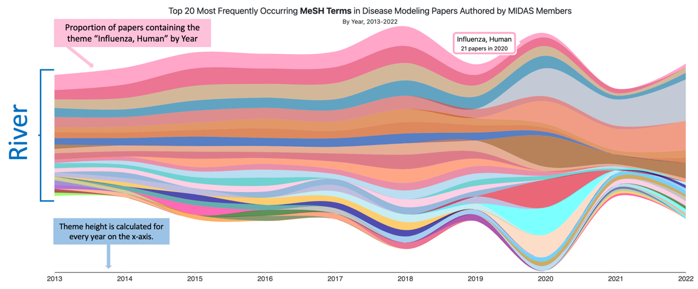

# MIDAS ThemeRiver

[](LICENSE)
[](docs/DATA.md)

An interactive, browser-based [ThemeRiver](https://ieeexplore.ieee.org/abstract/document/885098/)
visualization for exploring how research themes in infectious-disease modeling
papers by [MIDAS Network](https://midasnetwork.us) members shift over time.

Themes are extracted from PubMed metadata (MeSH terms, author keywords, and
title/abstract text) and rendered as colored ribbons flowing left-to-right; the
x-axis is time and the y-axis is the proportion of papers on each theme.

<p align="center">
  
</p>

## Features

- **Zero build step** — plain HTML/CSS/JS served as static files.
- **Data-driven controls** — the option toggles are generated at runtime from
  [`data/manifest.json`](docs/DATA.md#manifestjson), so adding a dataset needs
  **no code changes** (see [Adding a dataset](#adding-a-dataset)).
- **Interactive** — hover a ribbon for counts, click to list the underlying
  papers for that theme and year, and download the data behind any view.
- **Accessible** — keyboard-operable controls, ARIA roles, and semantic markup.

## Quick start

The app loads CSV/JSON from `data/` at runtime, so it must be served over HTTP
(opening `index.html` from disk will not work).

### Option 1 — Node dev server (recommended)

Includes automatic manifest regeneration on start.

```bash
npm install
npm start          # serves http://localhost:8001
```

### Option 2 — any static server

```bash
node scripts/build-manifest.js data   # generate data/manifest.json once
python3 -m http.server 8000           # serves http://localhost:8000
```

### Option 3 — Docker (production image)

```bash
docker build -f ../docker/midas-discover-themeriver/Dockerfile -t midas-themeriver ..
docker run -p 8080:8080 midas-themeriver
```

> `index.html` is generated from `index.template.html` by stamping the latest
> data year; in deployment this is handled by `scripts/stamp-themeriver-year.sh`.

## Adding a dataset

The visualization discovers datasets by **scanning the data directory** — you do
not edit any HTML or JavaScript.

1. Drop two files into `data/`, following the naming convention
   `<source>-ngram_<n>-counts.csv` and `<source>-ngram_<n>-papers.json`
   (see [docs/DATA.md](docs/DATA.md) for the exact schema). For example:
   `grants-ngram_1-counts.csv` and `grants-ngram_1-papers.json`.
2. (Optional) Give it a nice label, order, or make it the default in
   [`datasets.config.json`](datasets.config.json). Without an entry it still
   appears, with a label derived from the id.
3. Regenerate the manifest: `node scripts/build-manifest.js data`
   (or just restart `npm start`).

That's it — the new source appears as a control automatically. A source with a
single n-gram size (e.g. only `-ngram_1-`) automatically disables the N-gram
selector.

## Configuration

[`datasets.config.json`](datasets.config.json) controls presentation only
(labels, ordering, default selection, n-gram labels, and citation metadata).
It is optional; the app works without it.

## Project structure

| Path | Purpose |
|------|---------|
| `index.template.html` | Page shell (source of truth). |
| `index.html` | Generated from the template by the year-stamping script. |
| `js/main.js` | Renders the visualization and builds controls from the manifest. |
| `scripts/build-manifest.js` | Scans `data/` and writes `data/manifest.json`. |
| `css/themeriver.css` | App styles. |
| `data/` | Dataset CSV/JSON files and the generated manifest. |
| `datasets.config.json` | Optional labels / ordering / metadata. |
| `server.js` | Small Express dev server (not used in production). |

## Documentation

- [docs/DATA.md](docs/DATA.md) — data formats, file naming, and the manifest schema.
- [CONTRIBUTING.md](CONTRIBUTING.md) — development workflow and how to contribute.

## Citing

If you use this software or its data, please cite it — see
[CITATION.cff](CITATION.cff).

## License

- **Code:** [MIT](LICENSE).
- **Data** (`data/`): [Creative Commons Attribution 4.0](https://creativecommons.org/licenses/by/4.0/).

Questions: <questions@midasnetwork.us>
